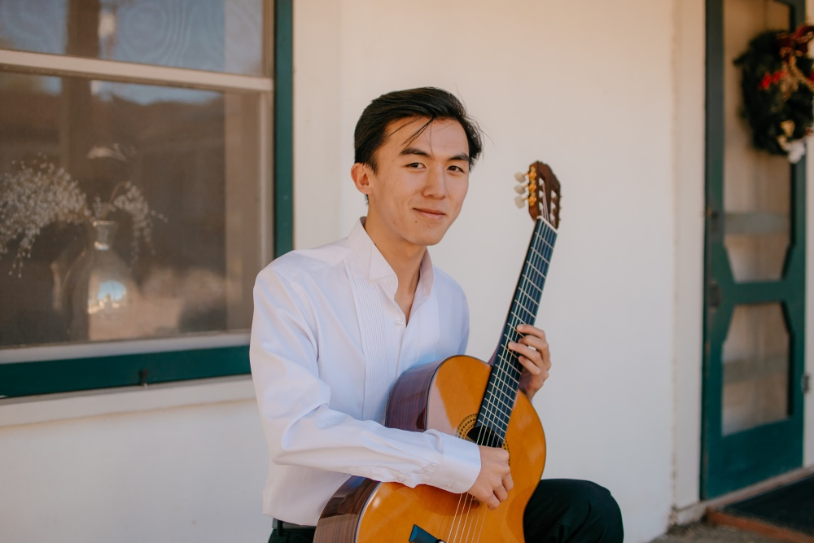

	

Shaped by interests which informed my upbringing, I have always been pulled in many directions. Whether you call it hopelessly distracted or fiercely devoted to ever-changing moments and topics, time and time again I return to three areas which continually provide a wealth of inspiration:

- Understanding the nature of the beauty and higher order function which has embedded itself in the fabric of our cosmos (mathematics).
- Training to become a better conduit for which that beauty can manifest itself in a form translatable across the human experience (music).
- Communicating the human experience across the vast intricacies and nuances which makes each of our individual worlds unique (language learning).

I am currently working towards obtaining my masters in biostatistics at UC San Diego. I created this website mainly as a place to showcase my interests and create resources that may hopefully help others. If you'd like to contact me regarding guitar lessons or anything else, please use my email:

<i>(my first name)@khangtong.com</i>

I hope this pit stop along your journey is a worthwhile one.

>The cities, the roads, the countryside, the people I meet -- they all begin to blur. I tell myself I am searching for something. But more and more, it feels like I am wandering, waiting for something to happen to me, something that will change everything, something that my whole life has been leading up to.
>
><cite>Hosseini, Khaled</cite> --- And the Mountains Echoed