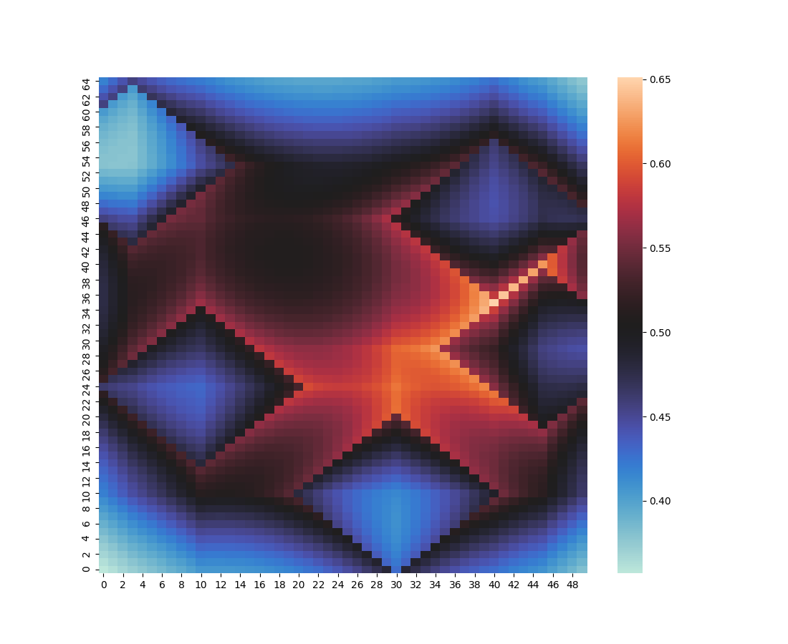
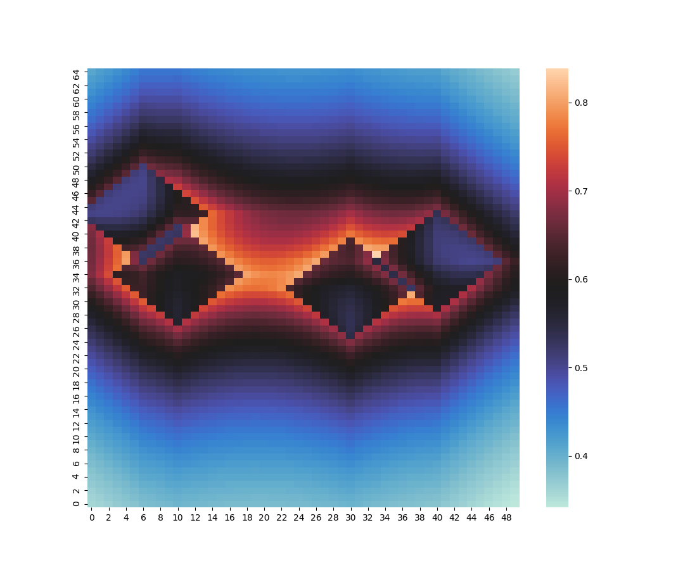

[Link](https://github.com/hophopkhangaroo/rossmo){:target="_blank" rel="noopener noreferrer"} to the Github page of this post.

Rossmo's formula was developed to find the likelihood of a serial criminalist's home location given the location of known committed crimes. The formula is based off of the assumption that a serial criminal will avoid committing crimes too close to their home (ie, there's a buffer zone between where they're likely to commit crimes and where they live) and that as the distance traveled from home increases, the effort to commit the crime increases and thus requires a greater reward to make the crime worthwhile. 

In other words, criminals will commit crimes outside a certain area close to their home but there exists a limit to how far they will travel before the effort becomes not worth it.

<p class="box def">
<strong>Rossmo's Formula</strong>
<br>
$\displaystyle p(x_{i,j}) = k \sum_c \frac{\phi_{i,j}}{d(x_{i,j},c)^f} + \frac{(1-\phi_{i,j})B^{f-g}}{(2B-d(x_{i,j},c))^g}$
<br><br>
where <br>
$\phi_{i,j} =
\begin{cases}
	1, & \text{if } d(x_{i,j},c) > B \\
	0, & \text{else}
\end{cases}$
<br>
$d(x_{i,j},c)$ is the taxicab metric between $x_{i,j}$ and crime location $c$. <br>
$B$ is the size of the buffer zone. <br>
$f,g$ are how fast the likelihood decays beyond and inside the buffer zone respectively.
</p>

Of course the limitations of this idea lie in the unpredictability and diversity of serial criminal behavior (human nature is fickle and messy; an individual spirit can't be reduced down to a formula). The assumptions made in Rossmo's formula are not always valid, limiting its usefulness. Still, it's fun to plot things and it provides one tool for apprehending serial criminals.

I was initially exposed to this idea from the pilot episode of [Numb3rs](https://en.wikipedia.org/wiki/Numbers_(TV_series)){:target="_blank" rel="noopener noreferrer"} and once again after reading [Jeremey Kun's](https://jeremykun.com/2011/07/20/serial-killers/){:target="_blank" rel="noopener noreferrer"} blog on the same subject.

At the moment, the code only generates a heatmap using the Seaborn library. In the future, I'd like to be able to generate a heatmap over actual map data and have points be automatically generated from a real-world location address.

Here are some sample heatmaps:



Crime Locations: $\{ (3, 53), (10, 24), (30, 10), (40, 46), (45, 29) \}$

$B = 10$

$f = 2/3$

$g = 3/4$



Crime locations: $\{ (6, 43), (10, 34), (30, 32), (40, 36) \}$

$B = 7$

$f = 3/5$

$g = 4/5$

To generate your own maps, download the files from the Github repository linked at the top of this page and edit the following lines from the `rossmo.py` file:

```python
#Grid Dimensions
nRows = 65
nCols = 50

#Known locations of committed crimes
crime_locations = [
    point.Point(3,53),
    point.Point(10,24),
    point.Point(30,10),
    point.Point(40,46),
    point.Point(45,29)
]

#Constants to be fiddled with to get alternate heatmaps
#buffer affects the size of the area around committed crimes that is unlikely
#to be where the serial criminal lives
#f affects how quickly the likelihood decays beyond the buffer zone
#g affects how quickly the likelihood decays within the buffer zone
buffer = 10
f = 2/3
g = 3/4
```

Then, in the command line, run `python rossmo.py` to generate the image.